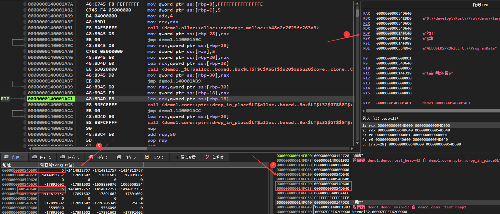

# Rust逆向之所有权

## 1.基本介绍

在写代码的过程中，申请内存资源是必须且经常的事情。对于所申请的内存资源的释放，不同编程语言有不同的处理方式。

对于C/C++这样的语言，需要开发人员手动释放内存资源。但是，开发人员手动释放内存资源的时候，很容易出现一些错误。以下是C/C++在资源释放方面经常会出现的一些错误，前三个往往是造成程序出现漏洞，而最后一个会造成资源的浪费。

```c
void test_function() {
    // use after free
    // 申请内存
    int *p = (int*)malloc(sizeof(int));

    // 其他代码

    //释放内存
    if (p != NULL)  free(p);
    // 其他代码

    // 向内存写入数据
    *p = 1;

    // double free
    // 申请内存
    int *p1 = (int*)malloc(sizeof(int));

    // 其他代码

    // 释放内存
    if (p1 != NULL)  free(p1);

    // 其他代码

    // 释放已经释放的内存
    free(p1);

    // null pointer dereference
    // 申请内存
    int *p2 = (int*) malloc(sizeof(int));

    //其他代码

    // 释放内存
    if (p2 != NULL) {
        free(p2);
        p2 = NULL;
    }

    // 其他代码

    // 释放NULL
    free(p2);

    // 未释放内存
    // 申请内存
    int *p3 = (int *) malloc(sizeof(int));
    if (p3 != NULL) {
        *p3 = 1;
    }
}
```

对于Java这样语言，是通过JVM的自动内存回收功能来实现内存资源的释放。但是，这种方式会降低程序运行时的效率。

为了解决上面的问题，Rust提出了所有权的概念。所有权是Rust最有特色的一个功能，作为内存安全的语言，它的内存安全就依赖于其所有权功能。该功能可以让Rust在没有垃圾回收机制的前提下，保证程序的内存安全。

Rust的所有权通过以下三条规则，在编译阶段对Rust代码进行分析。以保证内存资源的正确释放，从而避免内存资源的浪费以及可能带来的安全问题。

> - Rust中的每一个值都有一个对应的变量作为它的所有者
> 
> - 在同一时间内，值有且仅有一个所有者
> 
> - 当所有者离开自己的作用域时，它持有的值就会被释放掉

因为是编译阶段的机制，所以所有权功能对变量的检查不会体现在二进制文件中。

## 2.移动(move)

变量移动是实现上面说的所有权功能的三条规则的基础，也是Rust的一个特色。如果一个变量没有实现Copy这个trait。那么在复制的时候，将会移动该变量，导致该变量无效，后续对该变量会导致编译出错。比如下面的代码：

```rust
fn test_move() {
    let x = 5;
    let y = x;
    let z = x;

    let s = String::from("hello");
    let s1 = s;
    let s2 = s;
}
```

由于i32类型的变量实现了Copy trait，所以在执行let y = x；的时候，变量x的值会被复制到变量y中，后续可以继续使用x。而变量s没有实现Copy trait，所以在执行let s1 = s;的时候，会导致变量s移动到s1中，后续对s的使用会在编译的时候出现以下错误：

```shell
error[E0382]: use of moved value: `s`
  --> src\main.rs:16:14
   |
14 |     let s = String::from("hello");
   |         - move occurs because `s` has type `String`, which does not implement the `Copy` trait
15 |     let s1 = s;
   |              - value moved here
16 |     let s2 = s;
   |              ^ value used here after move
   |
```

该错误表明，由于String类型的变量s没有实现Copy trait，从而导致s进行了移动。继续使用移动以后的变量，就导致了上述错误。以下是Rust中，默认实现了Copy trait的变量类型：

> - 所有整数类型，比如i32
> 
> - 仅拥有两种值(true和false)的布尔类型：bool
> 
> - 字符类型: char
> 
> - 所有的浮点类型，比如f64
> 
> - 所有字段都具有Copy trait的元组

以下的代码是一个变量移动的例子，

```rust
fn test_move() {
    struct Test {
        x: i32,
        y: i32,
    }

    let t = Test {
        x: 3,
        y: 4,
    };

    let t1 = t;

    let y = t1.y;
} 
```

对应的汇编代码如下，从汇编代码可以看出来。在发生变量移动的时候，其实并没有进行变量的赋值，也就是说let t1 = t;这行代码并没有真的执行。从内存的角度看，后面对变量t1的使用，其实是直接使用变量t内存地址中保存的数据。

```nasm
.text:0000000140001920 demo__test_move proc near               
.text:0000000140001920
.text:0000000140001920                 sub     rsp, 10h
.text:0000000140001924                 mov     dword ptr [rsp+4], 3 ; 为变量t赋值
.text:000000014000192C                 mov     dword ptr [rsp+8], 4
.text:0000000140001934                 mov     eax, [rsp+8]    ; eax=t1.y
.text:0000000140001938                 mov     [rsp+0Ch], eax  ; y=t1.y
.text:000000014000193C                 add     rsp, 10h
.text:0000000140001940                 retn
.text:0000000140001940 demo__test_move endp
```

对于实现了Clone(克隆) trait，而没有实现Copy trait的变量。想要实现变量的复制，可以像下面的代码一样，调用clone函数来实现。由于现在对于t1的赋值，是通过t.clone()来克隆一个新的变量，所以变量t没有被移动，后续对变量t的使用就没有问题。

```rust
fn test_clone() {
    #[derive(Clone)]
    struct Test {
        x: i32,
        y: i32,
    }

    let t = Test {
        x: 3,
        y: 4,
    };

    let t1 = t.clone();

    let y = t.y;
}
```

对于汇编代码如下，这里可以看到。对于实现Clone trait的变量，在调用clone方法的时候，会将变量首地址作为第一个参数，然后调用clone函数。这里的clone函数test_clone__impl$0__clone，是针对结构体Test的函数。也就是说，对变量实现Clone trait的时候，Rust会为这个变量实现一个clone函数。后续将这个函数的返回值，赋值到一块新的内存区域中，来实现变量的克隆。

```nasm
.text:0000000140001950 demo__test_clone proc near 
.text:0000000140001950
.text:0000000140001950                 sub     rsp, 38h
.text:0000000140001954                 mov     dword ptr [rsp+24h], 3 ; 为变量x赋值
.text:000000014000195C                 mov     dword ptr [rsp+28h], 4
.text:0000000140001964                 lea     rcx, [rsp+24h]  ; demo::test_clone::Test *
.text:0000000140001969                 call    demo__test_clone__impl$0__clone
.text:000000014000196E                 mov     [rsp+2Ch], eax  ; 使用返回值为变量t1赋值
.text:0000000140001972                 mov     [rsp+30h], edx
.text:0000000140001976                 mov     eax, [rsp+28h]  ; eax=t.y
.text:000000014000197A                 mov     [rsp+34h], eax  ; y=t.y
.text:000000014000197E                 add     rsp, 38h
.text:0000000140001982                 retn
.text:0000000140001982 demo__test_clone endp
```

而test_clone__impl$0__clone函数也很简单，只是将变量t的值取出，作为返回值：

```nasm
.text:0000000140001AD0 ; demo::test_clone::Test __fastcall demo::test_clone::impl_0::clone(demo::test_clone::Test *)
.text:0000000140001AD0 demo__test_clone__impl$0__clone proc near
.text:0000000140001AD0
.text:0000000140001AD0                 sub     rsp, 10h
.text:0000000140001AD4                 mov     rax, rcx        ; rax=变量t的地址
.text:0000000140001AD7                 mov     [rsp+8], rax
.text:0000000140001ADC                 mov     ecx, [rax]      ; ecx=t.x
.text:0000000140001ADE                 mov     eax, [rax+4]    ; eax=t.y
.text:0000000140001AE1                 mov     [rsp], ecx      ; 保存t.x
.text:0000000140001AE4                 mov     [rsp+4], eax    ; 保存t.y
.text:0000000140001AE8                 mov     eax, [rsp]      ; eax=t.x
.text:0000000140001AEB                 mov     edx, [rsp+4]    ; edx=t.y
.text:0000000140001AEF                 add     rsp, 10h
.text:0000000140001AF3                 retn
.text:0000000140001AF3 demo__test_clone__impl$0__clone endp
```

最后看一个对结构体Test实现Copy trait，然后直接赋值的例子：

```rust
fn test_copy() {
    #[derive(Clone, Copy)]
    struct Test {
        x: i32,
        y: i32,
    }

    let t = Test {
        x: 3,
        y: 4,
    };

    let t1 = t;

    let x = t.x;
    let y = t1.y;
}
```

对应如下的反汇编，会发现生成的汇编代码类似于第一个例子：

```nasm
.text:0000000140001920 demo__test_copy proc near               
.text:0000000140001920                                 
.text:0000000140001920                 sub     rsp, 10h
.text:0000000140001924                 mov     dword ptr [rsp], 3 ; 为变量t赋值
.text:000000014000192B                 mov     dword ptr [rsp+4], 4
.text:0000000140001933                 mov     eax, [rsp]      ; eax=t.x
.text:0000000140001936                 mov     [rsp+8], eax    ; x=t.x
.text:000000014000193A                 mov     eax, [rsp+4]    ; eax=t1.y
.text:000000014000193E                 mov     [rsp+0Ch], eax  ; y=t1.y
.text:0000000140001942                 add     rsp, 10h
.text:0000000140001946                 retn
.text:0000000140001946 demo__test_copy endp
```

不过这个例子中，变量t和t1都是不可变的。下面的这个例子，变量t和t1都是可变的：

```rust
fn test_copy() {
    #[derive(Clone, Copy)]
    struct Test {
        x: i32,
        y: i32,
    }

    let mut t = Test {
        x: 3,
        y: 4,
    };

    let mut t1 = t;

    t1.x = 10;

    let t = t.x;
}
```

这个时候就会发现，为t1进行赋值的代码没有被删掉。函数会在一块新的内存区域中，将变量t的数值赋值给变量t1：

```nasm
.text:0000000140001820 demo__test_copy proc near           
.text:0000000140001820
.text:0000000140001820                 sub     rsp, 18h
.text:0000000140001824                 mov     dword ptr [rsp+4], 3 ; 初始化t
.text:000000014000182C                 mov     dword ptr [rsp+8], 4
.text:0000000140001834                 mov     ecx, [rsp+4]    ; ecx=t.x
.text:0000000140001838                 mov     eax, [rsp+8]    ; eax=t.y
.text:000000014000183C                 mov     [rsp+0Ch], ecx  ; 初始化t1
.text:0000000140001840                 mov     [rsp+10h], eax
.text:0000000140001844                 mov     dword ptr [rsp+0Ch], 10 ; t1.x=10
.text:000000014000184C                 mov     eax, [rsp+4]    ; eax=t.x
.text:0000000140001850                 mov     [rsp+14h], eax  ; x=t.x
.text:0000000140001854                 add     rsp, 18h
.text:0000000140001858                 retn
.text:0000000140001858 demo__test_copy endp
```

上面的例子中的变量都是在栈中，栈中的变量在函数退出的时候，会因为rsp寄存器的修改自动释放掉。所以，上面的例子，主要是感受所有权三条规则中的前两条。而这些例子可以直观的感受到，所有权机制是在编译阶段发挥作用。对于最终生成的二进制文件，是感受不到所有权机制的作用的。

## 3.堆

其实所有权机制对内存安全的保障，更多的是体现在堆内存中。以下是一个申请堆内存的例子：

```rust
fn test_heap() {
    let x = Box::new(5);
}
```

对于的反汇编如下，首先，函数会将栈底地址保存到ebp中。然后通过ebp，在栈底保存之后要在堆中存放的值，和-2(这个值不知道是干嘛的)。

```nasm
.text:0000000140001810 demo__test_heap proc near               
.text:0000000140001810                 push    rbp
.text:0000000140001811                 sub     rsp, 40h
.text:0000000140001815                 lea     rbp, [rsp+40h]  ; 获取栈底地址
.text:000000014000181A                 mov     qword ptr [rbp-8], 0FFFFFFFFFFFFFFFEh
.text:0000000140001822                 mov     dword ptr [rbp-0Ch], 5 ; 保存堆中保存的数据
.text:0000000140001829
.text:0000000140001829 loc_140001829:                          ; DATA XREF: .rdata:000000014001F140↓o
.text:0000000140001829 ;   try {                               ; unsigned __int64
.text:0000000140001829                 mov     edx, 4
.text:000000014000182E                 mov     rcx, rdx        ; unsigned __int64
.text:0000000140001831                 call    _ZN5alloc5alloc15exchange_malloc17h48a2c7f25fc263d3E ; alloc::alloc::exchange_malloc::h48a2c7f25fc263d3
```

然后将rcx和edx赋值为4，在调用_ZN5alloc5alloc15exchange_malloc17h48a2c7f25fc263d3E函数。根据IDA的注释，可以找到这个函数的源码如下，通过源码可以看出第一个参数就是要申请的堆内存大小，第二个值就是内存对齐大小。所以这里rcx和rdx都赋值为4，就是因为要申请一个i32变量，它的大小和内存对齐大小都是4.

```rust
/// The allocator for unique pointers.
#[cfg(all(not(no_global_oom_handling), not(test)))]
#[lang = "exchange_malloc"]
#[inline]
unsafe fn exchange_malloc(size: usize, align: usize) -> *mut u8 {
    let layout = unsafe { Layout::from_size_align_unchecked(size, align) };
    match Global.allocate(layout) {
        Ok(ptr) => ptr.as_mut_ptr(),
        Err(_) => handle_alloc_error(layout),
    }
}
```

申请完了以后，就会将_ZN5alloc5alloc15exchange_malloc17h48a2c7f25fc263d3E函数返回的堆地址，保存到栈中。然后，将从栈中取出该堆地址，将数值5赋值到该堆地址。最后，将该堆地址赋值给变量x。

```nasm
.text:0000000140001836 loc_140001836:                          ; DATA XREF: .rdata:000000014001F148↓o
.text:0000000140001836                 mov     [rbp-20h], rax  ; 将返回的堆地址保存起来
.text:000000014000183A                 jmp     short $+2      
.text:000000014000183C ; ---------------------------------------------------------------------------
.text:000000014000183C
.text:000000014000183C loc_14000183C:                          ; CODE XREF: demo__test_heap+2A↑j
.text:000000014000183C                 mov     rax, [rbp-20h]  
.text:0000000140001840                 mov     dword ptr [rax], 5 ; 为堆地址赋值为5
.text:0000000140001846                 mov     [rbp-18h], rax  ; 保存堆地址到变量x
```

在函数退出之前，会获取变量x的地址。再将这个地址作为第一个参数，调用drop函数来释放申请的堆内存。

```nasm
.text:000000014000184A                 lea     rcx, [rbp-18h]  ; int **
.text:000000014000184E                 call    _ZN4core3ptr49drop_in_place$LT$alloc__boxed__Box$LT$i32$GT$$GT$17hdd6c2c2dbce9827cE ; core::ptr::drop_in_place$LT$alloc..boxed..Box$LT$i32$GT$$GT$::hdd6c2c2dbce9827c
.text:0000000140001853                 nop
.text:0000000140001854                 add     rsp, 40h
.text:0000000140001858                 pop     rbp
.text:0000000140001859                 retn
.text:0000000140001859 ; } // starts at 140001810
.text:0000000140001859 demo__test_heap endp
```

动态调试一下，会发现整个流程和上面分析是一样，没看出有什么特别的，这里就不放出来了。从上面的分析可以知道，堆内存在退出函数，其实准确的说法是离开变量作用域的时候，会调用drop函数来释放堆内存。而栈内存中的数据，在函数退出的时候，会自动释放掉。因此，这也就符合了所有权规则中的第三条规则。

下面的Rust代码，展示了堆变量的移动。这里将x移动到y以后，就不能继续使用x变量。否则，就会出现上面说的变量已被移动的错误。

```rust
fn test_heap() {
    let x = Box::new(5);
    let y = x;
}
```

从反汇编看，对保存在堆中的变量进行移动。会将申请到的堆地址再赋值给一个栈内存中，该栈内存表示的就是变量y。由此看到，堆变量的移动和栈变量的移动的不同。栈变量移动的时候，移动的操作在二进制层面没有体现，而堆变量会将堆地址在赋值给一个新的栈变量。之后释放内存的时候，用的是这个移动之后的变量，也就是这里的变量y来释放。而变量x的地址，不会再被拿去调用drop函数，防止内存被两次释放。

```nasm
.text:0000000140001990 demo__test_heap proc near               
.text:0000000140001990                 push    rbp
.text:0000000140001991                 sub     rsp, 50h
.text:0000000140001995                 lea     rbp, [rsp+50h]
.text:000000014000199A                 mov     qword ptr [rbp-8], 0FFFFFFFFFFFFFFFEh
.text:00000001400019A2                 mov     dword ptr [rbp-0Ch], 5
.text:00000001400019A9
.text:00000001400019A9 loc_1400019A9:                                ; unsigned __int64
.text:00000001400019A9                 mov     edx, 4
.text:00000001400019AE                 mov     rcx, rdx        ; unsigned __int64
.text:00000001400019B1                 call    _ZN5alloc5alloc15exchange_malloc17h48a2c7f25fc263d3E ; alloc::alloc::exchange_malloc::h48a2c7f25fc263d3
.text:00000001400019B6 loc_1400019B6:                          ; DATA XREF: .rdata:000000014001F170↓o
.text:00000001400019B6                 mov     [rbp-28h], rax  ; 保存申请的堆内存地址
.text:00000001400019BA                 jmp     short $+2
.text:00000001400019BC ; ---------------------------------------------------------------------------
.text:00000001400019BC
.text:00000001400019BC loc_1400019BC:                          ; CODE XREF: demo__test_heap+2A↑j
.text:00000001400019BC                 mov     rax, [rbp-28h]   
.text:00000001400019C0                 mov     dword ptr [rax], 5  
.text:00000001400019C6                 mov     [rbp-18h], rax  ; 将堆地址保存到变量x中
.text:00000001400019CA                 mov     [rbp-20h], rax   ; 将堆地址保存到变量y中
.text:00000001400019CE                 lea     rcx, [rbp-20h]  ; int **
.text:00000001400019D2                 call    _ZN4core3ptr49drop_in_place$LT$alloc__boxed__Box$LT$i32$GT$$GT$17hdd6c2c2dbce9827cE ; core::ptr::drop_in_place$LT$alloc..boxed..Box$LT$i32$GT$$GT$::hdd6c2c2dbce9827c
.text:00000001400019D7                 nop
.text:00000001400019D8                 add     rsp, 50h
.text:00000001400019DC                 pop     rbp
.text:00000001400019DD                 retn
.text:00000001400019DD demo__test_heap endp
```

以下的代码，则是一个堆变量进行克隆的例子：

```rust
fn test_heap1() {
    let x = Box::new(5);
    let y = x.clone();
}
```

汇编代码如下，首先，对于变量x的赋值并没有任何改变。

```nasm
.text:0000000140001A70 demo__test_heap2 proc near              
.text:0000000140001A70                 push    rbp
.text:0000000140001A71                 sub     rsp, 50h
.text:0000000140001A75                 lea     rbp, [rsp+50h]
.text:0000000140001A7A                 mov     qword ptr [rbp-8], 0FFFFFFFFFFFFFFFEh
.text:0000000140001A82                 mov     dword ptr [rbp-0Ch], 5
.text:0000000140001A89
.text:0000000140001A89 loc_140001A89:                          ; DATA XREF: .rdata:000000014001F240↓o
.text:0000000140001A89 ;   try {                               ; unsigned __int64
.text:0000000140001A89                 mov     edx, 4
.text:0000000140001A8E                 mov     rcx, rdx        ; unsigned __int64
.text:0000000140001A91                 call    _ZN5alloc5alloc15exchange_malloc17h48a2c7f25fc263d3E ; alloc::alloc::exchange_malloc::h48a2c7f25fc263d3
.text:0000000140001A96                 mov     [rbp-28h], rax
.text:0000000140001A9A                 jmp     short $+2
.text:0000000140001A9C ; ---------------------------------------------------------------------------
.text:0000000140001A9C
.text:0000000140001A9C loc_140001A9C:                          ; CODE XREF: demo__test_heap2+2A↑j
.text:0000000140001A9C                 mov     rax, [rbp-28h]
.text:0000000140001AA0                 mov     dword ptr [rax], 5
.text:0000000140001AA6                 mov     [rbp-20h], rax  ; 将堆地址赋值给变量x
```

接下来，和调用drop一样的传参方式，来调用clone函数。返回值就回是一个新的堆地址，这个堆地址中保存的值也是5，随后将该堆地址赋值给变量y。

```nasm
.text:0000000140001AAA loc_140001AAA:                          ; DATA XREF: .rdata:000000014001F248↓o
.text:0000000140001AAA ;   try {                               ; int **
.text:0000000140001AAA                 lea     rcx, [rbp-20h]
.text:0000000140001AAE                 call    _ZN69_$LT$alloc__boxed__Box$LT$T$C$A$GT$$u20$as$u20$core__clone__Clone$GT$5clone17h74575b933fcc51ecE ; _$LT$alloc..boxed..Box$LT$T$C$A$GT$$u20$as$u20$core..clone..Clone$GT$::clone::h74575b933fcc51ec
.text:0000000140001AB3                 mov     [rbp-30h], rax
.text:0000000140001AB7                 jmp     short $+2
.text:0000000140001AB9 ; ---------------------------------------------------------------------------
.text:0000000140001AB9
.text:0000000140001AB9 loc_140001AB9:                          ; CODE XREF: demo__test_heap2+47↑j
.text:0000000140001AB9                 mov     rax, [rbp-30h]
.text:0000000140001ABD                 mov     [rbp-18h], rax  ; 将堆地址赋值给变量y
```

最后，在退出函数的时候，来调用drop分别释放掉变量y和变量x:

```nasm
.text:0000000140001AC1                 lea     rcx, [rbp-18h]  ; int **
.text:0000000140001AC5                 call    _ZN4core3ptr49drop_in_place$LT$alloc__boxed__Box$LT$i32$GT$$GT$17hdd6c2c2dbce9827cE ; core::ptr::drop_in_place$LT$alloc..boxed..Box$LT$i32$GT$$GT$::hdd6c2c2dbce9827c
.text:0000000140001AC5 ;   } // starts at 140001AAA
.text:0000000140001ACA
.text:0000000140001ACA loc_140001ACA:                          ; DATA XREF: .rdata:000000014001F250↓o
.text:0000000140001ACA                 jmp     short $+2
.text:0000000140001ACC ; ---------------------------------------------------------------------------
.text:0000000140001ACC
.text:0000000140001ACC loc_140001ACC:                          ; CODE XREF: demo__test_heap2:loc_140001ACA↑j
.text:0000000140001ACC                 lea     rcx, [rbp-20h]  ; int **
.text:0000000140001AD0                 call    _ZN4core3ptr49drop_in_place$LT$alloc__boxed__Box$LT$i32$GT$$GT$17hdd6c2c2dbce9827cE ; core::ptr::drop_in_place$LT$alloc..boxed..Box$LT$i32$GT$$GT$::hdd6c2c2dbce9827c
.text:0000000140001AD5                 nop
.text:0000000140001AD6                 add     rsp, 50h
.text:0000000140001ADA                 pop     rbp
.text:0000000140001ADB                 retn
.text:0000000140001ADB ; } // starts at 140001A70
.text:0000000140001ADB demo__test_heap2 endp
```

这里可以通过动态调试看到，对变量x和y赋值完成以后，这两个变量保存的地址是两块不同的堆地址。而这两块不同的堆地址中，保存的数据都是i32类型的5。



函数的参数和返回值也存在变量移动的特性，对于栈中数据，进行变量移动的表现之前的文章提过了。下面的例子，则是堆中数据进行变量的移动。

```rust
fn test_heap() {
    let x = Box::new(5);
    test(x);
}

fn test(x: Box<i32>) {
    let y = x;
}
```

test_heap函数的反汇编代码如下，这里对变量x的赋值和前面一样。在调用test函数的时候，函数的第一个参数是申请到的堆变量的地址。此外，test_heap函数执行结束的时候，这里不会调用drop函数来释放堆内存。因为，此时的变量x已经移动到函数test中。

```nasm
.text:0000000140001820 demo__test_heap proc near           
.text:0000000140001820                 push    rbp
.text:0000000140001821                 sub     rsp, 40h
.text:0000000140001825                 lea     rbp, [rsp+40h]
.text:000000014000182A                 mov     qword ptr [rbp-8], 0FFFFFFFFFFFFFFFEh
.text:0000000140001832                 mov     dword ptr [rbp-0Ch], 5
.text:0000000140001839
.text:0000000140001839 loc_140001839:                          ; DATA XREF: .rdata:000000014001F020↓o
.text:0000000140001839 ;   try {                               ; unsigned __int64
.text:0000000140001839                 mov     edx, 4
.text:000000014000183E                 mov     rcx, rdx        ; unsigned __int64
.text:0000000140001841                 call    _ZN5alloc5alloc15exchange_malloc17hbfcefceba03e97e8E ; alloc::alloc::exchange_malloc::hbfcefceba03e97e8
.text:0000000140001841 ;   } // starts at 140001839
.text:0000000140001846
.text:0000000140001846 loc_140001846:                          ; DATA XREF: .rdata:000000014001F028↓o
.text:0000000140001846                 mov     [rbp-20h], rax
.text:000000014000184A                 jmp     short $+2
.text:000000014000184C ; ---------------------------------------------------------------------------
.text:000000014000184C
.text:000000014000184C loc_14000184C:                          ; CODE XREF: demo__test_heap+2A↑j
.text:000000014000184C                 mov     rcx, [rbp-20h]  ; int *
.text:0000000140001850                 mov     dword ptr [rcx], 5
.text:0000000140001856                 mov     [rbp-18h], rcx  ; 保存变量x的地址
.text:000000014000185A                 call    test_pro__test
.text:000000014000185F                 nop
.text:0000000140001860                 add     rsp, 40h
.text:0000000140001864                 pop     rbp
.text:0000000140001865                 retn
.text:0000000140001865 ; } // starts at 140001820
.text:0000000140001865 demo__test_heap endp
```

在test函数中，会将堆变量地址保存起来，然后赋值给变量y。此时，函数结束的时候，会调用drop函数释放堆内存。因为，变量x已经被移动到该函数中，所以该函数退出的时候，该堆变量的生命周期就结束了。

```nasm
.text:0000000140001890 ; void __fastcall demo_pro::test(int *)
.text:0000000140001890 demo__test  proc near            
.text:0000000140001890                 sub     rsp, 38h
.text:0000000140001894                 mov     [rsp+30h], rcx  ; 保存堆地址
.text:0000000140001899                 mov     [rsp+28h], rcx  ; 将堆地址赋值给y
.text:000000014000189E                 lea     rcx, [rsp+28h]  
.text:00000001400018A3                 call    _ZN4core3ptr49drop_in_place$LT$alloc__boxed__Box$LT$i32$GT$$GT$17h83f77475b2c15f5dE ; core::ptr::drop_in_place$LT$alloc..boxed..Box$LT$i32$GT$$GT$::h83f77475b2c15f5d
.text:00000001400018A8                 nop
.text:00000001400018A9                 add     rsp, 38h
.text:00000001400018AD                 retn
.text:00000001400018AD demo__test  endp
```

下面的例子，将堆变量移动到test1函数之后，又将该变量返回到test_heap1函数中：

```rust
fn test_heap1() {
    let x = Box::new(5);
    let y = test1(x);
}

fn test1(x: Box<i32>)-> Box<i32> {
    let y = x;
    y
}
```

test_heap1的反汇编代码如下，此时，依然将堆变量地址作为第一个参数调用test1函数。test1函数的返回值，将被赋值给变量y，此时该值就是堆内存地址。然后，在通过变量y来调用drop函数释放内存。这是因为，此时的堆变量又被移动会test_heap1函数，所以该函数结束的时候，堆变量的生命周期就结束了。

```nasm
.text:00000001400018B0 demo__test_heap1 proc near          
.text:00000001400018B0                 push    rbp
.text:00000001400018B1                 sub     rsp, 50h
.text:00000001400018B5                 lea     rbp, [rsp+50h]
.text:00000001400018BA                 mov     qword ptr [rbp-8], 0FFFFFFFFFFFFFFFEh
.text:00000001400018C2                 mov     dword ptr [rbp-0Ch], 5
.text:00000001400018C9
.text:00000001400018C9 loc_1400018C9:                          ; DATA XREF: .rdata:000000014001F08C↓o
.text:00000001400018C9 ;   try {                               ; unsigned __int64
.text:00000001400018C9                 mov     edx, 4
.text:00000001400018CE                 mov     rcx, rdx        ; unsigned __int64
.text:00000001400018D1                 call    _ZN5alloc5alloc15exchange_malloc17hbfcefceba03e97e8E ; alloc::alloc::exchange_malloc::hbfcefceba03e97e8
.text:00000001400018D1 ;   } // starts at 1400018C9
.text:00000001400018D6
.text:00000001400018D6 loc_1400018D6:                          ; DATA XREF: .rdata:000000014001F094↓o
.text:00000001400018D6                 mov     [rbp-28h], rax
.text:00000001400018DA                 jmp     short $+2
.text:00000001400018DC ; ---------------------------------------------------------------------------
.text:00000001400018DC
.text:00000001400018DC loc_1400018DC:                          
.text:00000001400018DC                 mov     rcx, [rbp-28h]  ; int *
.text:00000001400018E0                 mov     dword ptr [rcx], 5
.text:00000001400018E6                 mov     [rbp-18h], rcx  ; 将堆地址赋值给变量x
.text:00000001400018EA                 call    test_pro__test1
.text:00000001400018EF                 mov     [rbp-20h], rax  ; 将返回值赋值给变量y
.text:00000001400018F3                 lea     rcx, [rbp-20h]  ; int **
.text:00000001400018F7                 call    _ZN4core3ptr49drop_in_place$LT$alloc__boxed__Box$LT$i32$GT$$GT$17h83f77475b2c15f5dE ; core::ptr::drop_in_place$LT$alloc..boxed..Box$LT$i32$GT$$GT$::h83f77475b2c15f5d
.text:00000001400018FC                 nop
.text:00000001400018FD                 add     rsp, 50h
.text:0000000140001901                 pop     rbp
.text:0000000140001902                 retn
.text:0000000140001902 ; } // starts at 1400018B0
.text:0000000140001902 demo__test_heap1 endp
```

此时，test1函数仅仅将堆内存地址赋值给变量y，不会再调用drop函数释放内存。

```nasm
.text:0000000140001930 demo__test1 proc near              
.text:0000000140001930
.text:0000000140001930                 push    rax
.text:0000000140001931                 mov     rax, rcx
.text:0000000140001934                 mov     [rsp], rax      ; 将堆变量赋值给y
.text:0000000140001938                 pop     rcx
.text:0000000140001939                 retn
.text:0000000140001939 demo__test1 endp
```

因此，使用堆变量作为参数和返回值的时候，在二进制层面最大的区别就是，根据堆变量生命周期结束的位置，决定释放该堆变量的时机。

# 4.所有权和函数

所有权的三条规则，在将变量作为函数的参数和返回值的时候依然适用。下面是一个简单的例子，由于Test没有实现Copy trait。所以在调用test函数的时候，变量t首先会移动到函数test中，然后在从test函数中作为返回值移动出来。

```rust
struct Test {
    x: i32,
    y: i32,
}

fn test(t: Test) -> Test {
    t
}

fn main() {
    let t = Test {
        x: 1,
        y: 2,
    };
    let t1 = test(t);
    // 可以使用t1，不能使用t
}
```

在汇编代码中，无论是函数调用还是执行，其实都看不出所有权的作用：

```nasm
.text:0000000140001010 ; void __fastcall demo::main()
.text:0000000140001010 demo__main      proc near           
.text:0000000140001010
.text:0000000140001010                 sub     rsp, 38h
.text:0000000140001014                 mov     dword ptr [rsp+28h], 1 ; 为变量t赋值
.text:000000014000101C                 mov     dword ptr [rsp+2Ch], 2
.text:0000000140001024                 mov     ecx, [rsp+28h]  ; demo::Test
.text:0000000140001028                 mov     edx, [rsp+2Ch]
.text:000000014000102C                 call    demo__test
.text:0000000140001031                 mov     [rsp+30h], eax  ; 将返回值赋值给变量t1
.text:0000000140001035                 mov     [rsp+34h], edx
.text:0000000140001039                 add     rsp, 38h
.text:000000014000103D                 retn
.text:000000014000103D demo__main      endp
```

```rust
.text:0000000140001000 ; demo::Test __fastcall demo::test(demo::Test)
.text:0000000140001000
.text:0000000140001000                 push    rax
.text:0000000140001001                 mov     eax, ecx
.text:0000000140001003                 mov     [rsp], eax      ; 将变量t保存在栈中
.text:0000000140001006                 mov     [rsp+4], edx
.text:000000014000100A                 pop     rcx
.text:000000014000100B                 retn
.text:000000014000100B demo__test      endp
```

除了普通函数，在成员函数self参数中，所有权机制同样发挥了作用。比如下面的代码，由于get_y函数的参数self不是一个引用。这就导致变量t会移动到get_y函数中，后续对变量t的使用将会导致出错。

```rust
struct Test {
    x: i32,
    y: i32,
}

impl Test {
    fn get_x(&self) -> i32 {
        self.x
    }
    fn get_y(self) -> i32 {
        self.y
    }
}

fn main() {
    let t = Test {
        x: 1,
        y: 2,
    };

    t.get_x();
    t.get_y();

    // 不能继续使用t
}
```

调用函数的汇编的汇编代码如下，当调用函数get_x的时候，会将变量t的地址作为第一个参数。而调用get_y函数的时候，则会将变量t中的x和y作为参数。这里可以看出，self和&self参数在函数传参时候是不同的。

```nasm
.text:0000000140001020 ; void __fastcall demo::main()
.text:0000000140001020 demo__main      proc near              
.text:0000000140001020                 sub     rsp, 28h
.text:0000000140001024                 mov     dword ptr [rsp+20h], 1 ; 为变量t赋值
.text:000000014000102C                 mov     dword ptr [rsp+24h], 2
.text:0000000140001034                 lea     rcx, [rsp+20h]  ; rcx=变量t地址
.text:0000000140001039                 call    demo__Test__get_x
.text:000000014000103E                 mov     ecx, [rsp+20h]  ; demo::Test
.text:0000000140001042                 mov     edx, [rsp+24h]
.text:0000000140001046                 call    demo__Test__get_y
.text:000000014000104B                 nop
.text:000000014000104C                 add     rsp, 28h
.text:0000000140001050                 retn
.text:0000000140001050 demo__main      endp
```

get_x函数会从rcx中保存的变量t的地址中，取出t.x的值作为返回值：

```nasm
.text:0000000140001000 ; int __fastcall demo::Test::get_x()
.text:0000000140001000 demo__Test__get_x proc near           
.text:0000000140001000                 push    rax
.text:0000000140001001                 mov     [rsp], rcx
.text:0000000140001005                 mov     eax, [rcx]      ; eax=t.x
.text:0000000140001007                 pop     rcx
.text:0000000140001008                 retn
.text:0000000140001008 demo__Test__get_x endp
```

而get_y函数则会将通过寄存器传递进来的，变量t的值保存在栈中。

```nasm
.text:0000000140001010 ; int __fastcall demo::Test::get_y(demo::Test)
.text:0000000140001010 demo__Test__get_y proc near         
.text:0000000140001010
.text:0000000140001010                 push    rax
.text:0000000140001011                 mov     eax, edx        ; eax=t.y
.text:0000000140001013                 mov     [rsp], ecx      ; 保存变量t的值到栈中
.text:0000000140001016                 mov     [rsp+4], eax
.text:000000014000101A                 pop     rcx
.text:000000014000101B                 retn
.text:000000014000101B demo__Test__get_y endp
```

下面是在堆变量在函数中移动的例子：

```rust
struct Test {
    x: i32,
    y: i32,
}

fn test(t: Box<Test>) {
    let t1 = t;
}

fn main() {
    let t = Box::new(Test {
        x: 1,
        y: 2,
    });

    test(t);

    // 不能继续使用t
}
```

对应的汇编代码如下，在调用函数的时候，申请的堆内存地址会作为第一个参数来调用test函数。且在main函数中，并没有调用drop函数来释放堆内存。

```rust
.text:0000000140001690 ; void __fastcall demo::main()
.text:0000000140001690 demo__main      proc near               
.text:0000000140001690                 push    rbp
.text:0000000140001691                 sub     rsp, 50h
.text:0000000140001695                 lea     rbp, [rsp+50h]
.text:000000014000169A                 mov     qword ptr [rbp-8], 0FFFFFFFFFFFFFFFEh
.text:00000001400016A2                 mov     dword ptr [rbp-20h], 1 ; 保存变量t的值在栈中
.text:00000001400016A9                 mov     dword ptr [rbp-1Ch], 2
.text:00000001400016B0                 mov     ecx, [rbp-20h]
.text:00000001400016B3                 mov     [rbp-30h], ecx
.text:00000001400016B6                 mov     eax, [rbp-1Ch]
.text:00000001400016B9                 mov     [rbp-2Ch], eax
.text:00000001400016BC                 mov     [rbp-10h], ecx
.text:00000001400016BF                 mov     [rbp-0Ch], eax
.text:00000001400016C2
.text:00000001400016C2 loc_1400016C2:                          ; DATA XREF: .rdata:000000014001E074↓o
.text:00000001400016C2 ;   try {                               ; unsigned __int64
.text:00000001400016C2                 mov     ecx, 8
.text:00000001400016C7                 mov     edx, 4          ; unsigned __int64
.text:00000001400016CC                 call    _ZN5alloc5alloc15exchange_malloc17h1d20c6f51673579eE ; alloc::alloc::exchange_malloc::h1d20c6f51673579e
.text:00000001400016CC ;   } // starts at 1400016C2
.text:00000001400016D1
.text:00000001400016D1 loc_1400016D1:                          ; DATA XREF: .rdata:000000014001E07C↓o
.text:00000001400016D1                 mov     [rbp-28h], rax  ; 保存申请到的堆内存的地址
.text:00000001400016D5                 jmp     short $+2
.text:00000001400016D7 ; ---------------------------------------------------------------------------
.text:00000001400016D7
.text:00000001400016D7 loc_1400016D7:                          ; CODE XREF: demo__main+45↑j
.text:00000001400016D7                 mov     rcx, [rbp-28h]  ; demo::Test *
.text:00000001400016DB                 mov     eax, [rbp-2Ch]  ; eax=t.y
.text:00000001400016DE                 mov     edx, [rbp-30h]  ; edx=t.x
.text:00000001400016E1                 mov     [rcx], edx      ; 为申请的堆内存赋值
.text:00000001400016E3                 mov     [rcx+4], eax
.text:00000001400016E6                 mov     [rbp-18h], rcx  ; 保存申请的堆内存地址
.text:00000001400016EA                 call    demo__test
.text:00000001400016EF                 nop
.text:00000001400016F0                 add     rsp, 50h
.text:00000001400016F4                 pop     rbp
.text:00000001400016F5                 retn
.text:00000001400016F5 ; } // starts at 140001690
.text:00000001400016F5 demo__main      endp
```

而在test函数内部，则会通过rcx保存的堆内存地址，来调用drop函数释放堆内存。

```nasm
.text:0000000140001670 ; void __fastcall demo::test(demo::Test *)
.text:0000000140001670 demo__test      proc near           
.text:0000000140001670
.text:0000000140001670                 sub     rsp, 38h
.text:0000000140001674                 mov     [rsp+30h], rcx
.text:0000000140001679                 mov     [rsp+28h], rcx
.text:000000014000167E                 lea     rcx, [rsp+28h]  ; demo::Test **
.text:0000000140001683                 call    _ZN4core3ptr56drop_in_place$LT$alloc__boxed__Box$LT$demo__Test$GT$$GT$17h4c038d9f3d5bde7aE ; core::ptr::drop_in_place$LT$alloc..boxed..Box$LT$demo..Test$GT$$GT$::h4c038d9f3d5bde7a
.text:0000000140001688                 nop
.text:0000000140001689                 add     rsp, 38h
.text:000000014000168D                 retn
.text:000000014000168D demo__test      endp
```

如果test函数修改成下面这样，将变量t再移动出来。就会发现，调用drop函数的操作是在main函数中完成的，而不是在test函数中完成。

```rust
fn test(t: Box<Test>) -> Box<Test>{
    let t1 = t;
    t1
}
```

下面是通过self参数来移动堆变量的例子：

```rust
struct Test {
    x: i32,
    y: i32,
}

impl Test {
    fn get_x(&self) -> i32 {
        self.x
    }
    fn get_y(self) -> i32 {
        self.y
    }
}

fn main() {
    let t = Box::new(Test {
        x: 1,
        y: 2,
    });

    let x = t.get_x();
    let y = t.get_y();

    // 不能继续使用t
}
```

函数调用的反汇编如下，调用test_x的时候，传递的是堆内存指针的指针。而调用test_y之前，会先判断堆内存地址最后3位是否为0。如果不为0，则会调用_ZN4core9panicking36panic_misaligned_pointer_dereference17h5099f0e5e95afcafE进行报错。如果为0，才会从堆内存中取出变量的值，作为参数来调用get_y函数。此外，虽然此时变量t已经被移动到函数get_y中。调用drop函数释放堆内存的操作，依然是在main函数中执行的，这是和普通函数不同的地方。

```nasm
.text:0000000140001690 ; void __fastcall demo::main()
.text:0000000140001690 demo__main      proc near            
.text:0000000140001690                 push    rbp
.text:0000000140001691                 sub     rsp, 70h
.text:0000000140001695                 lea     rbp, [rsp+70h]
.text:000000014000169A                 mov     qword ptr [rbp-8], 0FFFFFFFFFFFFFFFEh
.text:00000001400016A2                 mov     dword ptr [rbp-20h], 1
.text:00000001400016A9                 mov     dword ptr [rbp-1Ch], 2
.text:00000001400016B0                 mov     ecx, [rbp-20h]
.text:00000001400016B3                 mov     [rbp-38h], ecx
.text:00000001400016B6                 mov     eax, [rbp-1Ch]
.text:00000001400016B9                 mov     [rbp-34h], eax
.text:00000001400016BC                 mov     [rbp-10h], ecx
.text:00000001400016BF                 mov     [rbp-0Ch], eax
.text:00000001400016C2
.text:00000001400016C2 loc_1400016C2:                          ; DATA XREF: .rdata:000000014001F10C↓o
.text:00000001400016C2 ;   try {                               ; unsigned __int64
.text:00000001400016C2                 mov     ecx, 8
.text:00000001400016C7                 mov     edx, 4          ; unsigned __int64
.text:00000001400016CC                 call    _ZN5alloc5alloc15exchange_malloc17h1d20c6f51673579eE ; alloc::alloc::exchange_malloc::h1d20c6f51673579e
.text:00000001400016D1                 mov     [rbp-30h], rax  ; 保存申请的堆内存地址
.text:00000001400016D5                 jmp     short $+2       ; 为堆内存赋值
.text:00000001400016D7 ; ---------------------------------------------------------------------------
.text:00000001400016D7
.text:00000001400016D7 loc_1400016D7:                          ; CODE XREF: demo__main+45↑j
.text:00000001400016D7                 mov     rax, [rbp-30h]  ; 为堆内存赋值
.text:00000001400016DB                 mov     ecx, [rbp-34h]
.text:00000001400016DE                 mov     edx, [rbp-38h]
.text:00000001400016E1                 mov     [rax], edx
.text:00000001400016E3                 mov     [rax+4], ecx
.text:00000001400016E6                 mov     [rbp-28h], rax  ; 保存堆地址
.text:00000001400016EA                 mov     rcx, [rbp-28h]  ; rcx=保存堆内存地址的栈地址
.text:00000001400016EA ;   } // starts at 1400016C2
.text:00000001400016EE
.text:00000001400016EE loc_1400016EE:                          ; DATA XREF: .rdata:000000014001F114↓o
.text:00000001400016EE ;   try {
.text:00000001400016EE                 call    demo__Test__get_x
.text:00000001400016F3                 mov     [rbp-3Ch], eax  ; 为x赋值
.text:00000001400016F6                 jmp     short $+2
.text:00000001400016F8 ; ---------------------------------------------------------------------------
.text:00000001400016F8
.text:00000001400016F8 loc_1400016F8:                          ; CODE XREF: demo__main+66↑j
.text:00000001400016F8                 mov     eax, [rbp-3Ch]
.text:00000001400016FB                 mov     [rbp-18h], eax
.text:00000001400016FE                 mov     rax, [rbp-28h]  ; rax=堆地址
.text:0000000140001702                 mov     [rbp-48h], rax  ; 保存堆地址
.text:0000000140001706                 and     rax, 3
.text:000000014000170A                 cmp     rax, 0
.text:000000014000170E                 setz    al
.text:0000000140001711                 test    al, 1           ; 判断低3位是否为0
.text:0000000140001713                 jnz     short loc_140001717 ; 为0则跳转
.text:0000000140001715                 jmp     short loc_14000172A ; 堆内存地址低3位不为0，则报错
.text:0000000140001717 ; ---------------------------------------------------------------------------
.text:0000000140001717
.text:0000000140001717 loc_140001717:                          ; CODE XREF: demo__main+83↑j
.text:0000000140001717                 mov     rax, [rbp-48h]  ; rax=堆地址
.text:000000014000171B                 mov     ecx, [rax]      ; demo::Test
.text:000000014000171D                 mov     edx, [rax+4]
.text:0000000140001720                 call    demo__Test__get_y
.text:0000000140001720 ;   } // starts at 1400016EE
.text:0000000140001725
.text:0000000140001725 loc_140001725:                          ; DATA XREF: .rdata:000000014001F11C↓o
.text:0000000140001725                 mov     [rbp-4Ch], eax
.text:0000000140001728                 jmp     short loc_14000173F
.text:000000014000172A ; ---------------------------------------------------------------------------
.text:000000014000172A
.text:000000014000172A loc_14000172A:                          ; CODE XREF: demo__main+85↑j
.text:000000014000172A                 mov     rdx, [rbp-48h]  ; 堆内存地址低3位不为0，则报错
.text:000000014000172E                 lea     r8, off_14001A490 ; "src\\main.rs"
.text:0000000140001735                 mov     ecx, 4
.text:000000014000173A                 call    _ZN4core9panicking36panic_misaligned_pointer_dereference17h5099f0e5e95afcafE ; core::panicking::panic_misaligned_pointer_dereference::h5099f0e5e95afcaf
.text:000000014000173F ; ---------------------------------------------------------------------------
.text:000000014000173F
.text:000000014000173F loc_14000173F:                          ; CODE XREF: demo__main+98↑j
.text:000000014000173F                 mov     eax, [rbp-4Ch]
.text:0000000140001742                 mov     [rbp-14h], eax
.text:0000000140001745                 lea     rcx, [rbp-28h]  ; 释放堆内存
.text:0000000140001749                 call    _ZN4core3ptr56drop_in_place$LT$alloc__boxed__Box$LT$demo__Test$GT$$GT$17h4c038d9f3d5bde7aE ; core::ptr::drop_in_place$LT$alloc..boxed..Box$LT$demo..Test$GT$$GT$::h4c038d9f3d5bde7a
.text:000000014000174E                 nop
.text:000000014000174F                 add     rsp, 70h
.text:0000000140001753                 pop     rbp
.text:0000000140001754                 retn
.text:0000000140001754 ; } // starts at 140001690
.text:0000000140001754 demo__main      endp
```

至于get_x和get_y函数，没有什么特别的地方，这里就不放出来了。
