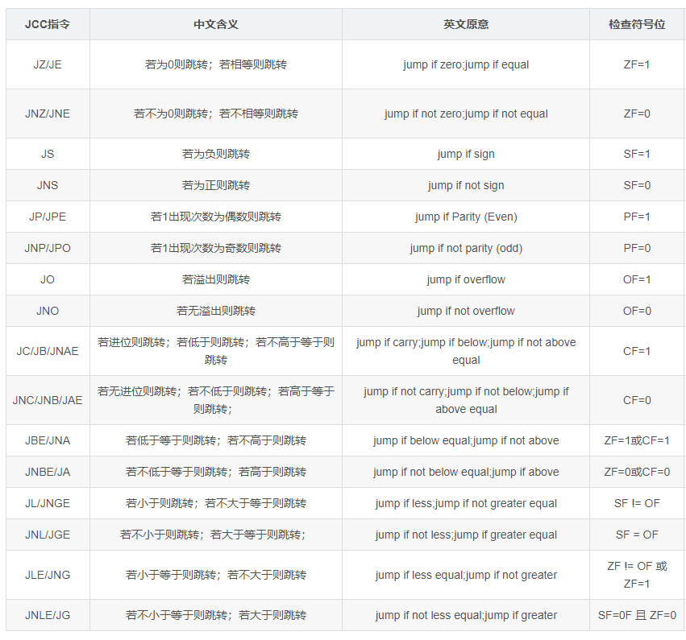
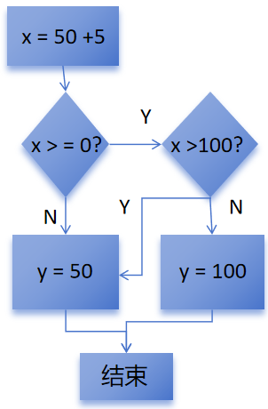
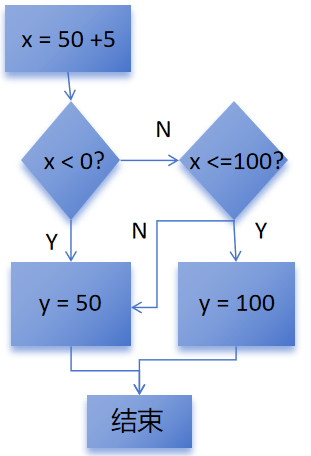

# Rust逆向之条件判断

在Rust中所有条件判断必须使用布尔类型，也就是其他类型无法自动转换为布尔类型。对于if 1 这样的语句，Rust编译器会直接报错。在汇编层面，跳转指令如下图所示：



## 1.if-else条件判断

如下代码，是最常规的条件判断语句。

```rust
fn test_ifelse() {
    let x = 100 + 5;
    let mut b = 0;

    if x > 100 {
        b = x;
    } else {
        b = 100;
    }
}
```

对应反汇编如下，这里会判断x是否大于100

```nasm
.text:0000000140001170 test_pro__test_ifelse proc near   
.text:0000000140001170                 sub     rsp, 38h
.text:0000000140001174                 mov     eax, 100
.text:0000000140001179                 add     eax, 5
.text:000000014000117C                 mov     [rsp+2Ch], eax
.text:0000000140001180                 seto    al
.text:0000000140001183                 test    al, 1
.text:0000000140001185                 jnz     short loc_14000119E ; 判断100+5是否整型溢出
.text:0000000140001187                 mov     eax, [rsp+2Ch]
.text:000000014000118B                 mov     [rsp+34h], eax  ; x = 100 + 5
.text:000000014000118F                 mov     dword ptr [rsp+30h], 0 ; y=0
.text:0000000140001197                 cmp     eax, 100
.text:000000014000119A                 jg      short loc_1400011C0 ; x > 100则跳转
.text:000000014000119C                 jmp     short loc_1400011B6
```

如果大于100，则将x赋值给y，然后退出函数：

```nasm
.text:00000001400011C0 loc_1400011C0:                          ; CODE XREF: test_pro__test_ifelse+2A↑j
.text:00000001400011C0                 mov     eax, [rsp+2Ch]  ; eax=x
.text:00000001400011C4                 mov     [rsp+30h], eax  ; y=x
.text:00000001400011C8
.text:00000001400011C8 loc_1400011C8:                          ; CODE XREF: test_pro__test_ifelse+4E↑j
.text:00000001400011C8                 add     rsp, 38h
.text:00000001400011CC                 retn
.text:00000001400011CC test_pro__test_ifelse endp
```

否则的话，会跳过输出整型溢出错误的逻辑，继续向下执行else块中的代码，然后退出函数：

```nasm
.text:00000001400011B6 loc_1400011B6:                          ; CODE XREF: test_pro__test_ifelse+2C↑j
.text:00000001400011B6                 mov     dword ptr [rsp+30h], 100 ; y=100
.text:00000001400011BE                 jmp     short loc_1400011C8
```

这里可以看出Rust和C/C++的不同，C/C++会按代码的顺序翻译指令。也就是C/C++在遇到这样的逻辑的时候，会先判断x是否小于等于100。如果不是，则会继续向下执行if条件成立的代码，否则则会进行跳转，去运行else块中的代码。

对于如下if-else if - else结构的代码来说，生成的反汇编逻辑和上面是一样的，只是多了一个else-if的判断。

```rust
fn test_elseif() {
    let x = 100 + 5;
    let mut b = 0;

    if x > 100 {
        b = x;
    } else if x < 100{
        b = 10;
    } else {
        b = 100;
    }
}
```

首先，函数会判断是否大于100：

```nasm
.text:00000001400011A0 test_pro__test_elseif proc near    
.text:00000001400011A0                 sub     rsp, 38h
.text:00000001400011A4                 mov     eax, 100
.text:00000001400011A9                 add     eax, 5
.text:00000001400011AC                 mov     [rsp+2Ch], eax  ; x = 100 + 5
.text:00000001400011B0                 seto    al
.text:00000001400011B3                 test    al, 1
.text:00000001400011B5                 jnz     short loc_1400011CE ; 判断是否溢出
.text:00000001400011B7                 mov     eax, [rsp+2Ch]  ; eax=x
.text:00000001400011BB                 mov     [rsp+34h], eax  ; 保存x的值
.text:00000001400011BF                 mov     dword ptr [rsp+30h], 0 ; y=0
.text:00000001400011C7                 cmp     eax, 100
.text:00000001400011CA                 jg      short loc_1400011F1 ; x大于100则跳转
.text:00000001400011CC                 jmp     short loc_1400011E6
```

是的话，则将x赋值给y，然后跳转到退出函数的地方:

```rust
.text:00000001400011F1 loc_1400011F1:                          ; CODE XREF: test_pro__test_elseif+2A↑j
.text:00000001400011F1                 mov     eax, [rsp+2Ch]  ; eax=x
.text:00000001400011F5                 mov     [rsp+30h], eax  ; y=x
.text:00000001400011F9                 jmp     short loc_14000120D
```

不大于100，则继续判断x是否小于100：

```nasm
.text:00000001400011E6 loc_1400011E6:                          ; CODE XREF: test_pro__test_elseif+2C↑j
.text:00000001400011E6                 mov     eax, [rsp+2Ch]  ; eax=x
.text:00000001400011EA                 cmp     eax, 100
.text:00000001400011ED                 jl      short loc_140001205 ; 小于100则跳转
.text:00000001400011EF                 jmp     short loc_1400011FB122B
```

小于100，则将10赋值给y，随后退出函数:

```nasm
.text:0000000140001205 loc_140001205:                          ; CODE XREF: test_pro__test_elseif+4D↑j
.text:0000000140001205                 mov     dword ptr [rsp+30h], 10 ; y=10
.text:000000014000120D
.text:000000014000120D loc_14000120D:                          ; CODE XREF: test_pro__test_elseif+59↑j
.text:000000014000120D                                         ; test_pro__test_elseif+63↑j
.text:000000014000120D                 add     rsp, 38h
.text:0000000140001211                 retn
.text:0000000140001211 test_pro__test_elseif endp
```

如果等于100，则将100赋值给y，然后退出函数：

```nasm
.text:00000001400011FB loc_1400011FB:                          ; CODE XREF: test_pro__test_elseif+4F↑j
.text:00000001400011FB                 mov     dword ptr [rsp+30h], 100 ; y=100
.text:0000000140001203                 jmp     short loc_14000120D
```

Rust中的if-else语句还有一种如下的用法，类似于C/C++中的三元运算符。经过逆向发现，生成的反汇编和前面if-else结构生成的反汇编是一样的，这里就不在放出来了。

```rust
fn test() {
    let x = 100 + 5;
    let b = if x > 100 { x } else { 100 };
}
```

## 2.&&和||运算符

&&和||运算符经常在进行条件判断的时候出现，对于如下代码：

```rust
fn test1(){
    let x = 50 + 5;
    let mut y = 0;

    if x >= 0 && x <= 100 {
        y = 50;
    } else {
        y = 100;
    }
}
```

函数会首先判断x是否大于等于0:

```nasm
.text:0000000140001170 test_pro__test1 proc near       
.text:0000000140001170                 sub     rsp, 38h
.text:0000000140001174                 mov     eax, 50
.text:0000000140001179                 add     eax, 5
.text:000000014000117C                 mov     [rsp+2Ch], eax  ; x=50+5
.text:0000000140001180                 seto    al
.text:0000000140001183                 test    al, 1
.text:0000000140001185                 jnz     short loc_14000119E ; 判断整型溢出
.text:0000000140001187                 mov     eax, [rsp+2Ch]  ; eax=x
.text:000000014000118B                 mov     [rsp+34h], eax  ; 保存x
.text:000000014000118F                 mov     dword ptr [rsp+30h], 0 ; y=0
.text:0000000140001197                 cmp     eax, 0
.text:000000014000119A                 jge     short loc_1400011C0 ; x>=0则跳转
.text:000000014000119C                 jmp     short loc_1400011B6
```

如果大于等于0则继续判断，是否大于100，如果不大于100，则将y赋值为50，然后退出函数：

```nasm
.text:00000001400011C0 loc_1400011C0:                          ; CODE XREF: test_pro__test1+2A↑j
.text:00000001400011C0                 mov     eax, [rsp+2Ch]
.text:00000001400011C4                 cmp     eax, 100
.text:00000001400011C7                 jg      short loc_1400011B6 ; x>100则跳转
.text:00000001400011C9                 mov     dword ptr [rsp+30h], 50 ; y=50
.text:00000001400011D1
.text:00000001400011D1 loc_1400011D1:                          ; CODE XREF: test_pro__test1+4E↑j
.text:00000001400011D1                 add     rsp, 38h
.text:00000001400011D5                 retn
.text:00000001400011D5 test_pro__test1 endp
```

而如果在判断x>=0的情况下不跳转，则函数会跳过整型溢出检查的代码，来执行下面将y赋值为100的逻辑。或者在判断x>100的时候跳转了，也会将y赋值为100，然后跳转到退出函数的地址继续执行：

```nasm
.text:00000001400011B6 loc_1400011B6:                          ; CODE XREF: test_pro__test1+2C↑j
.text:00000001400011B6                                         ; test_pro__test1+57↓j
.text:00000001400011B6                 mov     dword ptr [rsp+30h], 100 ; y=100
.text:00000001400011BE                 jmp     short loc_1400011D11D1
```

这里总结一下&&运算符在汇编层面的逻辑如下图：



对于||运算符，代码则如下：

```rust
fn test2() {
    let x = 50 + 5;
    let mut y = 0;

    if x < 0 || x > 100 {
        y = 100;
    } else {
        y = 50;
    }
}
```

首先，判断x是否小于0：

```rust
.text:00000001400011E0 test_pro__test2 proc near     
.text:00000001400011E0                 sub     rsp, 38h
.text:00000001400011E4                 mov     eax, 50
.text:00000001400011E9                 add     eax, 5
.text:00000001400011EC                 mov     [rsp+2Ch], eax  ; x=50+5
.text:00000001400011F0                 seto    al
.text:00000001400011F3                 test    al, 1
.text:00000001400011F5                 jnz     short loc_14000120E ; 判断整型溢出
.text:00000001400011F7                 mov     eax, [rsp+2Ch]  ; eax=x
.text:00000001400011FB                 mov     [rsp+34h], eax  ; 保存x
.text:00000001400011FF                 mov     dword ptr [rsp+30h], 0 ; y=0
.text:0000000140001207                 cmp     eax, 0
.text:000000014000120A                 jl      short loc_14000122F ; x<0则跳转
.text:000000014000120C                 jmp     short loc_140001226
```

如果小于0，则将y赋值为100，然后跳转到退出函数的地址：

```rust
.text:000000014000122F loc_14000122F:                          ; CODE XREF: test_pro__test2+2A↑j
.text:000000014000122F                 mov     dword ptr [rsp+30h], 100 ; y=100
.text:0000000140001237                 jmp     short loc_140001241
```

如果x>=0，继续判断x是否<=100，如果x大于100，就会继续向下执行上面将y赋值给100的代码：

```nasm
.text:0000000140001226 loc_140001226:                          ; CODE XREF: test_pro__test2+2C↑j
.text:0000000140001226                 mov     eax, [rsp+2Ch]  ; eax=x
.text:000000014000122A                 cmp     eax, 100
.text:000000014000122D                 jle     short loc_140001239 ; x<=100则跳转
```

否则的话，就会执行y=50的代码，然后退出函数：

```nasm
.text:0000000140001239 loc_140001239:                          ; CODE XREF: test_pro__test2+4D↑j
.text:0000000140001239                 mov     dword ptr [rsp+30h], 50 ; y=50
.text:0000000140001241
.text:0000000140001241 loc_140001241:                          ; CODE XREF: test_pro__test2+57↑j
.text:0000000140001241                 add     rsp, 38h
.text:0000000140001245                 retn
.text:0000000140001245 test_pro__test2 endp
```

所以此时的代码逻辑如下图：



## 3.match表达式

Rust中的match表达式，类似于C/C++中的switch-case。下面是一个最基础的用法，match中的_=>{}和c/c++的default关键字一样，用于处理均不匹配各项条件的默认情况。Rust编译器会要求，match表达式一定要匹配所有的情况，如果不能全写出来，就要用=>{}来处理默认情况。

```rust
fn test_match() {
    let x = 1 + 1;
    let mut y = 0;

    match x {
        1 => {
            y = 1;
        },
        2 => {
            y = 2;
        },
        3 => {
            y = 3;
        }
        _ => {
            y = 30;
        }
    }
}
```

对应反汇编如下，首先判断是否等于1，

```nasm
.text:0000000140001180 test_pro__test_match proc near    
.text:0000000140001180                 sub     rsp, 38h
.text:0000000140001184                 mov     eax, 1
.text:0000000140001189                 inc     eax
.text:000000014000118B                 mov     [rsp+2Ch], eax  ; x=1+1
.text:000000014000118F                 seto    al
.text:0000000140001192                 test    al, 1
.text:0000000140001194                 jnz     short loc_1400011C3 ; 判断整型溢出
.text:0000000140001196                 mov     eax, [rsp+2Ch]  ; eax=x
.text:000000014000119A                 mov     [rsp+34h], eax
.text:000000014000119E                 mov     dword ptr [rsp+30h], 0 ; y=0
.text:00000001400011A6                 sub     eax, 1
.text:00000001400011A9                 jz      short loc_1400011E5 ; 为1则跳转
```

如果x为1，则跳转执行y=1，然后在跳转退出函数：

```nasm
.text:00000001400011E5 loc_1400011E5:                          ; CODE XREF: test_pro__test_match+29↑j
.text:00000001400011E5                 mov     dword ptr [rsp+30h], 1 ; y=1
.text:00000001400011ED                 jmp     short loc_140001201
```

如果x不等于1，继续向下判断x是否等于2：

```nasm
.text:00000001400011AD loc_1400011AD:                          ; CODE XREF: test_pro__test_match+2B↑j
.text:00000001400011AD                 mov     eax, [rsp+2Ch]  ; eax=x
.text:00000001400011B1                 sub     eax, 2
.text:00000001400011B4                 jz      short loc_1400011EF ; x=2则跳转
```

如果x等于2，则将y赋值为2，然后退出函数：

```nasm
.text:00000001400011EF loc_1400011EF:                          ; CODE XREF: test_pro__test_match+34↑j
.text:00000001400011EF                 mov     dword ptr [rsp+30h], 2 ; y=2
.text:00000001400011F7                 jmp     short loc_140001201
```

x不等于2，就继续判断x是否等于3：

```nasm
.text:00000001400011B8 loc_1400011B8:                          ; CODE XREF: test_pro__test_match+36↑j
.text:00000001400011B8                 mov     eax, [rsp+2Ch]
.text:00000001400011BC                 sub     eax, 3
.text:00000001400011BF                 jz      short loc_1400011F9 ; x=3则跳转
.text:00000001400011C1                 jmp     short loc_1400011DB
```

x等于3，则将y赋值为3，然后退出函数：

```nasm
.text:00000001400011F9 loc_1400011F9:                          ; CODE XREF: test_pro__test_match+3F↑j
.text:00000001400011F9                 mov     dword ptr [rsp+30h], 3 ; y=2
.text:0000000140001201
.text:0000000140001201 loc_140001201:                          ; CODE XREF: test_pro__test_match+63↑j
.text:0000000140001201                                         ; test_pro__test_match+6D↑j ...
.text:0000000140001201                 add     rsp, 38h
.text:0000000140001205                 retn
.text:0000000140001205 test_pro__test_match endp
```

x不等于3，则跳转到将y赋值为30：

```nasm
.text:00000001400011DB loc_1400011DB:                          ; CODE XREF: test_pro__test_match+41↑j
.text:00000001400011DB                 mov     dword ptr [rsp+30h], 30
.text:00000001400011E3                 jmp     short loc_140001201
```

上面是match表达式需要匹配分支比较少的情况下，而如果是下面这种分支比较多的情况，代码逻辑就会不同：

```rust
fn test_match1() {
    let x = 1 + 1;
    let mut y = 0;

    match x {
        1 => {
            y = 1;
        },
        2 => {
            y = 2;
        },
        3 => {
            y = 3;
        },
        4 => {
            y = 4;
        },
        5 => {
            y = 5;
        },
        6 => {
            y = 6;
        },
        7 => {
            y = 7;
        },
        8 => {
            y = 8;
        },
        9 => {
            y = 9;
        },
        10 => {
            y = 10;
        },
        _ => {
            y = 100;
        }
    }
}
```

函数会首先将x-1和9相减，然后用ja这条指令来选择是否判断。如果x大于10，这里会跳转。如果x <= 0，根据那么x-1就变成负数，也就是首位变成1，还是大于9，依然会跳转。所以这里是当x不在1到9中的时候就会跳转：

```nasm
.text:0000000140001210 test_pro__test_match1 proc near 
.text:0000000140001210                 sub     rsp, 38h
.text:0000000140001214                 mov     eax, 1
.text:0000000140001219                 inc     eax
.text:000000014000121B                 mov     [rsp+2Ch], eax  ; x=1+1
.text:000000014000121F                 seto    al
.text:0000000140001222                 test    al, 1
.text:0000000140001224                 jnz     short loc_140001259 ; 判断整型
.text:0000000140001226                 mov     eax, [rsp+2Ch]  ; eax=x
.text:000000014000122A                 mov     [rsp+34h], eax
.text:000000014000122E                 mov     dword ptr [rsp+30h], 0 ; y=0
.text:0000000140001236                 dec     eax             ; switch 10 cases
.text:0000000140001238                 mov     ecx, eax
.text:000000014000123A                 mov     [rsp+20h], rcx  ; 保存x-1的值
.text:000000014000123F                 sub     eax, 9
.text:0000000140001242                 ja      short def_140001257 ; x-1>9，则跳转
```

如果跳转了，就会执行=>{}中的代码，将y赋值为30，然后退出函数：

```nasm
.text:0000000140001271 def_140001257:                          ; CODE XREF: test_pro__test_match1+32↑j
.text:0000000140001271                 mov     dword ptr [rsp+30h], 100 ; jumptable 0000000140001257 default case
.text:0000000140001279                 jmp     short loc_1400012DD
```

如果没跳转，函数会将x-1作为下标，从jpt_140001257数组中取出值。然后该值和jpt_140001257数组的地址进行相加，作为要执行的目标地址进行jmp。

```nasm
.text:0000000140001249                 lea     rcx, jpt_140001257 ; rcx等于jpt_140001257的地址
.text:0000000140001250                 movsxd  rax, dword ptr [rcx+rax*4] ; rax=jpt_140001257[x-1]
.text:0000000140001254                 add     rax, rcx        ; rax加上jpt_140001257的地址
.text:0000000140001257                 jmp     rax
```

jpt中保存的则是不同地址和jpt_140001257数组地址的偏移，后面减去的140019400h就是pt_140001257数组地址的地址。根据这个可以知道，其实上面的jmp rax就是根据x-9的值来跳转到下面的loc_14000127B,loc_140001285...这些地址。

```nasm
.rdata:0000000140019400 jpt_140001257   dd offset loc_14000127B - 140019400h
.rdata:0000000140019400                                         ; DATA XREF: test_pro__test_match1+39↑o
.rdata:0000000140019404                 dd offset loc_140001285 - 140019400h ; jump table for switch statement
.rdata:0000000140019408                 dd offset loc_14000128F - 140019400h
.rdata:000000014001940C                 dd offset loc_140001299 - 140019400h
.rdata:0000000140019410                 dd offset loc_1400012A3 - 140019400h
.rdata:0000000140019414                 dd offset loc_1400012AD - 140019400h
.rdata:0000000140019418                 dd offset loc_1400012B7 - 140019400h
.rdata:000000014001941C                 dd offset loc_1400012C1 - 140019400h
.rdata:0000000140019420                 dd offset loc_1400012CB - 140019400h
.rdata:0000000140019424                 dd offset loc_1400012D5 - 140019400h
```

而上面说的那些地址中的代码，就是在match语句匹配到不同的情况下，对y赋予不同值然后退出函数：

```nasm
.text:000000014000127B loc_14000127B:                          ; CODE XREF: test_pro__test_match1+47↑j
.text:000000014000127B                                         ; DATA XREF: .rdata:jpt_140001257↓o
.text:000000014000127B                 mov     dword ptr [rsp+30h], 1 ; jumptable 0000000140001257 case 1
.text:0000000140001283                 jmp     short loc_1400012DD
.text:0000000140001285 ; ---------------------------------------------------------------------------
.text:0000000140001285
.text:0000000140001285 loc_140001285:                          ; CODE XREF: test_pro__test_match1+47↑j
.text:0000000140001285                                         ; DATA XREF: .rdata:jpt_140001257↓o
.text:0000000140001285                 mov     dword ptr [rsp+30h], 2 ; jumptable 0000000140001257 case 2
.text:000000014000128D                 jmp     short loc_1400012DD
.text:000000014000128F ; ---------------------------------------------------------------------------
.text:000000014000128F
.text:000000014000128F loc_14000128F:                          ; CODE XREF: test_pro__test_match1+47↑j
.text:000000014000128F                                         ; DATA XREF: .rdata:jpt_140001257↓o
.text:000000014000128F                 mov     dword ptr [rsp+30h], 3 ; jumptable 0000000140001257 case 3
.text:0000000140001297                 jmp     short loc_1400012DD
.text:0000000140001299 ; ---------------------------------------------------------------------------
.text:0000000140001299
.text:0000000140001299 loc_140001299:                          ; CODE XREF: test_pro__test_match1+47↑j
.text:0000000140001299                                         ; DATA XREF: .rdata:jpt_140001257↓o
.text:0000000140001299                 mov     dword ptr [rsp+30h], 4 ; jumptable 0000000140001257 case 4
.text:00000001400012A1                 jmp     short loc_1400012DD
.text:00000001400012A3 ; ---------------------------------------------------------------------------
.text:00000001400012A3
.text:00000001400012A3 loc_1400012A3:                          ; CODE XREF: test_pro__test_match1+47↑j
.text:00000001400012A3                                         ; DATA XREF: .rdata:jpt_140001257↓o
.text:00000001400012A3                 mov     dword ptr [rsp+30h], 5 ; jumptable 0000000140001257 case 5
.text:00000001400012AB                 jmp     short loc_1400012DD
.text:00000001400012AD ; ---------------------------------------------------------------------------
.text:00000001400012AD
.text:00000001400012AD loc_1400012AD:                          ; CODE XREF: test_pro__test_match1+47↑j
.text:00000001400012AD                                         ; DATA XREF: .rdata:jpt_140001257↓o
.text:00000001400012AD                 mov     dword ptr [rsp+30h], 6 ; jumptable 0000000140001257 case 6
.text:00000001400012B5                 jmp     short loc_1400012DD
.text:00000001400012B7 ; ---------------------------------------------------------------------------
.text:00000001400012B7
.text:00000001400012B7 loc_1400012B7:                          ; CODE XREF: test_pro__test_match1+47↑j
.text:00000001400012B7                                         ; DATA XREF: .rdata:jpt_140001257↓o
.text:00000001400012B7                 mov     dword ptr [rsp+30h], 7 ; jumptable 0000000140001257 case 7
.text:00000001400012BF                 jmp     short loc_1400012DD
.text:00000001400012C1 ; ---------------------------------------------------------------------------
.text:00000001400012C1
.text:00000001400012C1 loc_1400012C1:                          ; CODE XREF: test_pro__test_match1+47↑j
.text:00000001400012C1                                         ; DATA XREF: .rdata:jpt_140001257↓o
.text:00000001400012C1                 mov     dword ptr [rsp+30h], 8 ; jumptable 0000000140001257 case 8
.text:00000001400012C9                 jmp     short loc_1400012DD
.text:00000001400012CB ; ---------------------------------------------------------------------------
.text:00000001400012CB
.text:00000001400012CB loc_1400012CB:                          ; CODE XREF: test_pro__test_match1+47↑j
.text:00000001400012CB                                         ; DATA XREF: .rdata:jpt_140001257↓o
.text:00000001400012CB                 mov     dword ptr [rsp+30h], 9 ; jumptable 0000000140001257 case 9
.text:00000001400012D3                 jmp     short loc_1400012DD
.text:00000001400012D5 ; ---------------------------------------------------------------------------
.text:00000001400012D5
.text:00000001400012D5 loc_1400012D5:                          ; CODE XREF: test_pro__test_match1+47↑j
.text:00000001400012D5                                         ; DATA XREF: .rdata:jpt_140001257↓o
.text:00000001400012D5                 mov     dword ptr [rsp+30h], 10 ; jumptable 0000000140001257 case 10
.text:00000001400012DD
.text:00000001400012DD loc_1400012DD:                          ; CODE XREF: test_pro__test_match1+69↑j
.text:00000001400012DD                                         ; test_pro__test_match1+73↑j ...
.text:00000001400012DD                 add     rsp, 38h
.text:00000001400012E1                 retn
.text:00000001400012E1 test_pro__test_match1 endp
```

所以对于上面两种情况，match表达式和C/C++中的switch-case表达式逻辑是一样的。如果要匹配的情况比较少，就会在函数前面判断所有条件，如果符合条件就会跳转过去执行。如果要匹配的情况比较多，就会生成一个跳转表，然后根据偏移去计算要执行的代码地址，再跳过去直接执行，降低系统的开销。

Rust运行用|符号将不同的情况放到一起，比如下面的代码，如果x等于2，15或100都会将y赋值为1，否则为100。

```rust
fn test_match2() {
    let x = 1 + 1;
    let mut y = 0;

    match x {
        2 | 15 | 100 => {
            y = 1;
        },
        _ => {
            y = 100;
        }
    }
}
```

对于的反汇编就会在一开始就判断x是否等于2，5，15这三个数中的任意一个，是的话就会跳转到loc_140001355中继续执行：

```nasm
.text:00000001400012F0 test_pro__test_match2 proc near      
.text:00000001400012F0                 sub     rsp, 38h
.text:00000001400012F4                 mov     eax, 1
.text:00000001400012F9                 inc     eax
.text:00000001400012FB                 mov     [rsp+2Ch], eax  ; x=1+1
.text:00000001400012FF                 seto    al
.text:0000000140001302                 test    al, 1
.text:0000000140001304                 jnz     short loc_140001333 ; 判断整型溢出
.text:0000000140001306                 mov     eax, [rsp+2Ch]  ; eax=x
.text:000000014000130A                 mov     [rsp+34h], eax
.text:000000014000130E                 mov     dword ptr [rsp+30h], 0 ; y=0
.text:0000000140001316                 sub     eax, 2
.text:0000000140001319                 jz      short loc_140001355 ; x=2则跳转
.text:000000014000131B                 jmp     short $+2       ; eax=x
.text:000000014000131D ; ---------------------------------------------------------------------------
.text:000000014000131D
.text:000000014000131D loc_14000131D:                          ; CODE XREF: test_pro__test_match2+2B↑j
.text:000000014000131D                 mov     eax, [rsp+2Ch]  ; eax=x
.text:0000000140001321                 sub     eax, 0Fh
.text:0000000140001324                 jz      short loc_140001355 ; x=15则跳转
.text:0000000140001326                 jmp     short $+2
.text:0000000140001328 ; ---------------------------------------------------------------------------
.text:0000000140001328
.text:0000000140001328 loc_140001328:                          ; CODE XREF: test_pro__test_match2+36↑j
.text:0000000140001328                 mov     eax, [rsp+2Ch]
.text:000000014000132C                 sub     eax, 100
.text:000000014000132F                 jz      short loc_140001355 ; x等于100则跳转
.text:0000000140001331                 jmp     short loc_14000134B
```

loc_140001355就会将y赋值为1，然后退出函数：

```nasm
.text:0000000140001355 loc_140001355:                          ; CODE XREF: test_pro__test_match2+29↑j
.text:0000000140001355                                         ; test_pro__test_match2+34↑j ...
.text:0000000140001355                 mov     dword ptr [rsp+30h], 1 ; y=1
.text:000000014000135D
.text:000000014000135D loc_14000135D:                          ; CODE XREF: test_pro__test_match2+63↑j
.text:000000014000135D                 add     rsp, 38h
.text:0000000140001361                 retn
.text:0000000140001361 test_pro__test_match2 endp
```

如果和2，5，15都不想等，则会将y赋值为100，然后退出函数：

```nasm
.text:000000014000134B loc_14000134B:                          ; CODE XREF: test_pro__test_match2+41↑j
.text:000000014000134B                 mov     dword ptr [rsp+30h], 100 ; y=100
.text:0000000140001353                 jmp     short loc_14000135D
```

Rust允许match表达式有返回值，比如如下代码做的事情就和第一个例子一样。最后生成的反汇编也一样，这里就不放出来了。

```nasm
fn test_match3() {
    let x = 1 + 1;

    let y = match x {
        1 => {
            1
        },
        2 => {
            2
        },
        3 => {
            3
        },
        _ => {
            30
        }
    };
}
```

Rust提供了if let语法来简化match表达式，比如下面代码，当x等于2的时候会为y赋值为2，否则不做任何事情：

```rust
fn test_match4() {
    let x = 1 + 1;
    let mut y = 0;

    if let 2 = x {
        y = 2;
    }
}
```

对应的反汇编也相对简单，判断x是否等于2：

```nasm
.text:00000001400013F0 test_pro__test_match4 proc near    
.text:00000001400013F0                 sub     rsp, 38h
.text:00000001400013F4                 mov     eax, 1
.text:00000001400013F9                 inc     eax
.text:00000001400013FB                 mov     [rsp+2Ch], eax  ; x=1+1
.text:00000001400013FF                 seto    al
.text:0000000140001402                 test    al, 1
.text:0000000140001404                 jnz     short loc_14000141D ; 整型溢出判断
.text:0000000140001406                 mov     eax, [rsp+2Ch]  ; eax=x
.text:000000014000140A                 mov     [rsp+34h], eax
.text:000000014000140E                 mov     dword ptr [rsp+30h], 0 ; y=0
.text:0000000140001416                 cmp     eax, 2
.text:0000000140001419                 jz      short loc_140001435 ; x=2则跳转
.text:000000014000141B                 jmp     short loc_14000143D
```

如果x等于2，就会将y赋值为2，然后退出函数。如果不等于2就会直接跳转到退出函数的代码，其实就是少了=>{}这一部分的代码逻辑。

```nasm
.text:0000000140001435 loc_140001435:                          ; CODE XREF: test_pro__test_match4+29↑j
.text:0000000140001435                 mov     dword ptr [rsp+30h], 2 ; y=2
.text:000000014000143D
.text:000000014000143D loc_14000143D:                          ; CODE XREF: test_pro__test_match4+2B↑j
.text:000000014000143D                 add     rsp, 38h
.text:0000000140001441                 retn
.text:0000000140001441 test_pro__test_match4 endp
```
